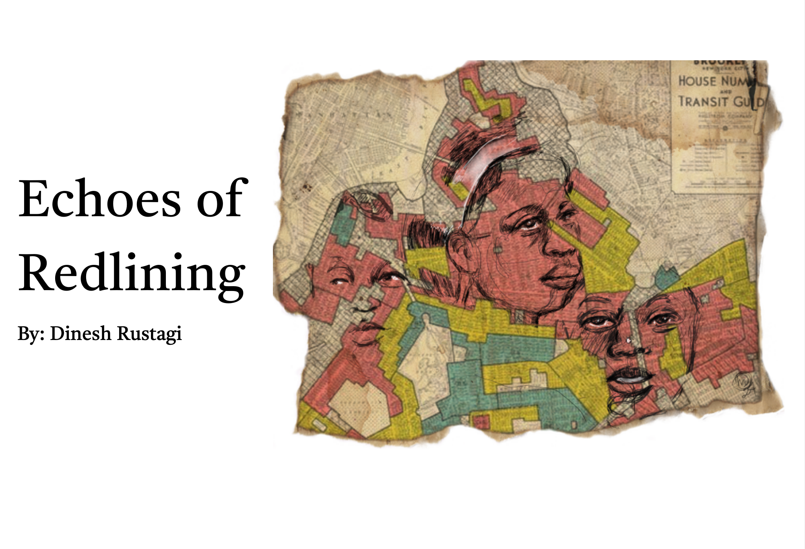

# Echoes of Redlining

(https://public.tableau.com/app/profile/dinesh.rustagi/viz/EchoesofRedlining/FinalPresentation)

This project investigates the relationship between historic redlining and modern policing patterns in San Francisco. I transposed historic redlining maps onto modern SF neighborhoods using QGIS to identify areas with a history of discriminatory housing practices. Using aggregated traffic stop data by race, I analyzed policing trends and found that Black individuals are stopped 8.5% more per capita than White individuals, highlighting racial disparities. I created an interactive Tableau data story to visualize these patterns and presented the findings to my class, demonstrating how historical factors can influence contemporary enforcement practices.
